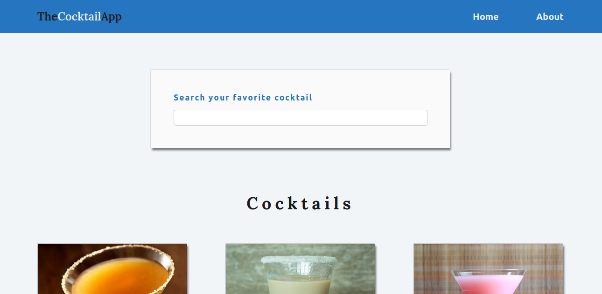
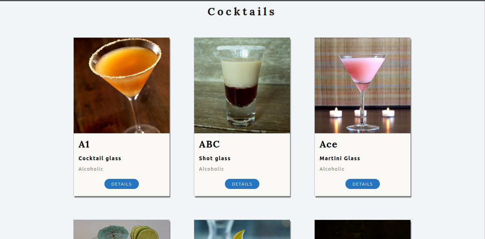
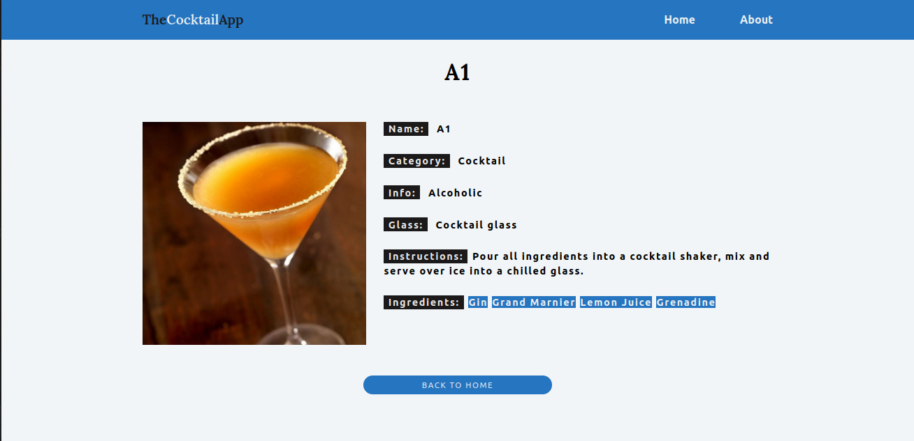

# The Cocktail App
[](https://github.com/KlevertonOliveira/TheCocktailApp---ReactJS/blob/master/LICENSE)

# About the project / Sobre o projeto

https://klevoliveira-thecocktailapp.netlify.app/

TheCocktailApp is a Front End application created with the objective of practicing the development of web applications using the ReactJS library. The application is inspired on the project called Cocktails by John Smilga in his course called Full React Course 2020 and it's main purpose is to practice the concept od React Routes.

The project consists of a set of cocktails, whose informations are fetched directly from an API, which are displayed to the user in cards using a grid system. The application provides a cocktail search bar that, when triggered, returns the result of the search to the user (either the cocktail found or a 'not found' message). Also, the user can interact with the presented drinks by hovering them and/or clicking on the 'Details' button inside each drink card. By clicking on the said button, the user is redirected to a page with more detailed information about the selected cocktail.

///

TheCocktailApp é uma aplicação Front End criada com o objetivo de praticar o desenvolvimento de aplicações web utilizando a biblioteca ReactJS. O aplicativo é inspirado no projeto Cocktails de John Smilga em seu curso Full React Course 2020 e tem como objetivo principal praticar o conceito de React Routes.

O projeto consiste em um conjunto de coquetéis, cujas informações são buscadas diretamente de uma API, os quais são apresentados ao usuário em cartões através de um sistema de grid. O aplicativo fornece uma barra de pesquisa de coquetéis que, quando acionada, retorna o resultado da pesquisa ao usuário (seja o coquetel encontrado ou uma mensagem de 'não encontrado'). Além disso, o usuário pode interagir com as bebidas apresentadas passando o mouse sobre elas e/ou clicando no botão 'Details' dentro de cada cartão de bebida. Ao clicar no referido botão, o usuário é redirecionado para uma página com informações mais detalhadas sobre o coquetel selecionado. 

## Layout web




# Technologies Used / Tecnologias utilizadas

## Front end
- HTML5
- CSS3
- JS ES6
- ReactJS

## Deployment in production / Implantação em produção
- Front end web: Netlify

#  How to run the project / Como executar o projeto

Prerequisites / Pré-requisitos: npm / yarn

```bash
# Clone repository / Clonar repositório
git clone https://github.com/KlevertonOliveira/TheCocktailApp---ReactJS

# Enter the project folder / Entrar na pasta do projeto
cd thecocktailapp---ReactJS

# Install dependencies / Instalar dependências
yarn install

# Run the project / Executar o projeto
yarn start
```

# Author / Autor

José Kleverton Yvens Oliveira

https://www.linkedin.com/in/kleverton-oliveira-1393ba1b8/

